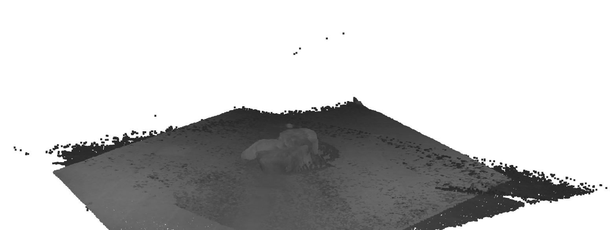
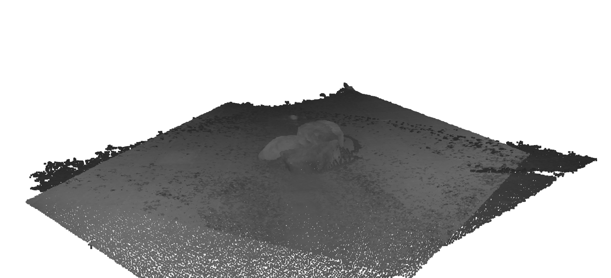
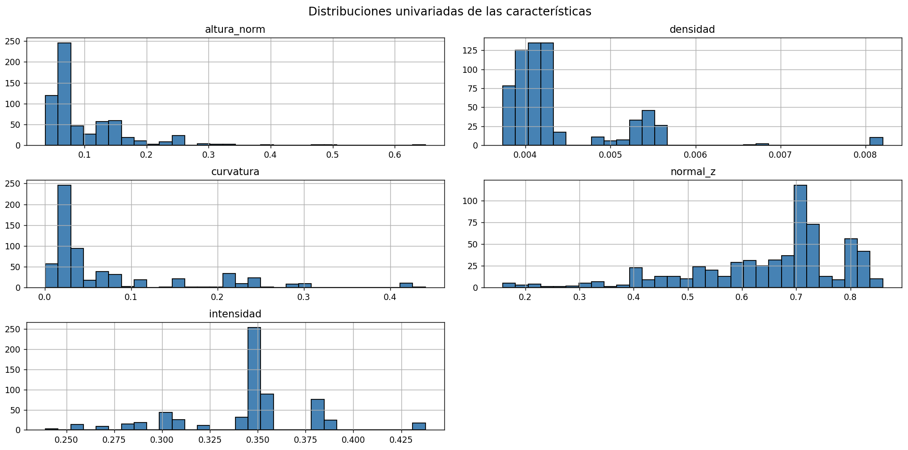
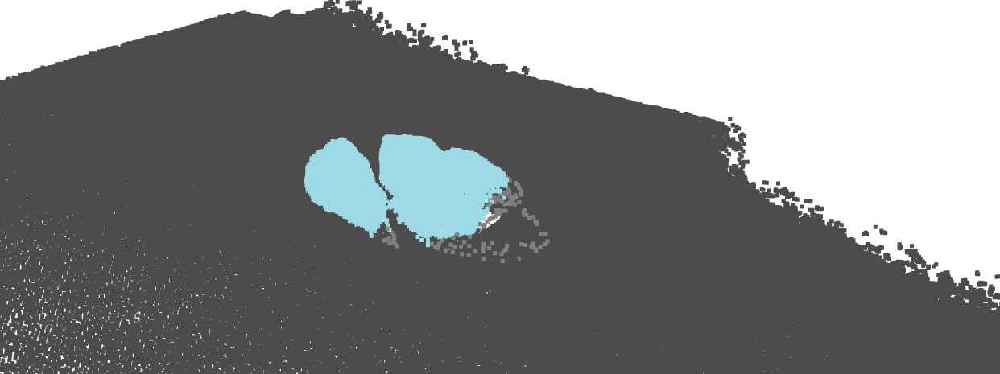
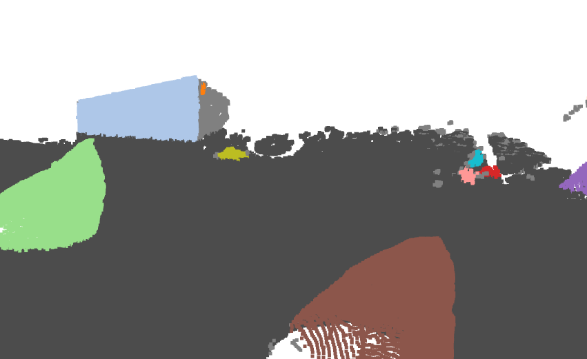
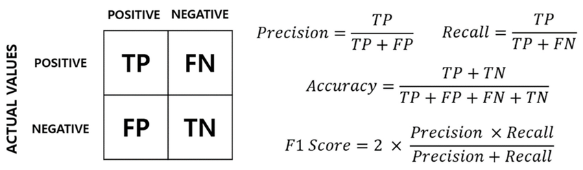
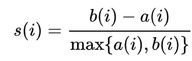
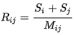

# 3dcamera — Segmentación de Rocas en Tiempo Real con Basler ToF 101

**Tesis:** Mecanismos de autosupervisión para la generación de entornos hiperrealistas en gemelos digitales  
**Autor:** Angel Pérez Pérez — Universidad de Santiago de Chile (USACH)  
**Directores:** Dr. Francisco Cubillos Montecino · Dr. John Kern Molina

> Para entender en detalle el experimento ML, la metodología y los resultados completos, consultar la presentación:  
> `docs/Tarea Angel Pérez Pérez.pptx`

---

## Inicio rápido

```powershell
# 1. Permitir ejecución de scripts en esta sesión
set-executionpolicy -scope process -executionpolicy bypass

# 2. Activar entorno virtual
.venv3d\Scripts\Activate.ps1

# 3. Instalar dependencias
pip install -r requirements.txt

# 4. Ejecutar visor offline (sin cámara)
py viewer_seg.py --offline "frames/*.npz"
```

---

## ¿Qué hace este proyecto?

Detecta y segmenta morfologías de rocas en nubes de puntos 3D capturadas con una cámara **Basler blaze-101 ToF** en tiempo real, usando el pipeline de Machine Learning desarrollado en la tesis:

1. **Limpieza de outliers** estadísticos (elimina 3–7% de puntos ruidosos)
2. **Separación suelo/objetos** mediante RANSAC (plano dominante = piso)
3. **Extracción de 5 features globales** por nube: `altura_norm`, `densidad`, `curvatura`, `normal_z`, `intensidad`
4. **Clasificación XGBoost** → `prob_roca` por nube (pseudo-etiquetas de K-Means, clusters con mayor curvatura = roca)
5. **DBSCAN** solo en nubes con alta probabilidad → clusters individuales de rocas con OBB
6. **Visualización:** suelo en gris, cada roca en un color distinto con caja orientada (OBB)

---

## Entorno de desarrollo

**Entorno virtual:** `.venv3d`

```powershell
# Activar (Windows PowerShell)
.\.venv3d\Scripts\Activate.ps1

# Instalar dependencias
pip install -r requirements.txt
```

**Dependencias principales:** `pypylon==4.2.0`, `open3d`, `scikit-learn`, `scipy`, `xgboost`, `joblib`, `numpy`, `opencv-python`

---

## Uso — Segmentación de rocas

### 1. Con cámara conectada (laboratorio)
```powershell
py viewer_seg.py
```

### 2. Sin cámara (desde casa, modo offline)
```powershell
py viewer_seg.py --offline "frames/*.npz"
```

### 3. Capturar frames para uso offline (requiere cámara)
```powershell
py save_frame.py --n 10 --out frames
```

### 4. Servidor en tiempo real con streaming a Blender (UDP) + RPC
```powershell
py server_blaze_seg.py
```

> **Nota:** `viewer_seg.py` y `server_blaze_seg.py` no pueden ejecutarse al mismo tiempo — ambos requieren acceso exclusivo a la cámara.

---

## Entrenar el clasificador XGBoost (una vez)

Requiere el CSV del proyecto ML: `features_clean_con_posible_roca.csv` (632 nubes de puntos de rocas escaneadas en faenas mineras).

```powershell
py train_model.py --csv path/to/features_clean_con_posible_roca.csv
```

Genera `models/rock_classifier.joblib` y `models/rock_scaler.joblib`.  
Sin modelo entrenado el sistema usa un proxy basado en altura (funcional pero menos preciso).

---

## Pipeline ML — Detalle

### 1. Limpieza de outliers

Remoción estadística: elimina puntos cuya distancia a sus vecinos supera `std_ratio × σ`. Elimina entre **3–7%** del total de puntos, preservando la geometría de las rocas.

| Antes (con outliers) | Después (limpia) |
|:---:|:---:|
|  |  |

---

### 2. Features globales por nube

Se calculan **5 descriptores geométricos** sobre los puntos no-suelo de cada nube. Capturan altitud, densidad, rugosidad, orientación y reflectancia — suficientes para discriminar suelo plano de objetos elevados.



| Feature | Descripción |
|---|---|
| `altura_norm` | Altura media normalizada por rango Z |
| `densidad` | Media de 1/distancia al vecino más cercano |
| `curvatura` | Desviación estándar de distancias k-NN |
| `normal_z` | Variación de Z en vecindad local |
| `intensidad` | Canal de intensidad ToF normalizado |

---

### 3. Clasificación XGBoost + Segmentación DBSCAN

XGBoost recibe los 5 features de una nube y devuelve `prob_roca`. Si `prob_roca ≥ 0.5`, DBSCAN encuentra los clusters individuales de rocas. El terreno se muestra en gris y cada roca en un color distinto.

| DBSCAN — vista 1 | DBSCAN — vista 2 |
|:---:|:---:|
|  |  |

XGBoost seleccionó **411 de 632 nubes** del dataset como nubes con morfología rocosa relevante.

---

## Métricas de evaluación

### Clasificador XGBoost

| Métrica | Fórmula |
|---|---|
| Precision / Recall / F1 / Accuracy |  |

### Clustering (Silhouette y Davies–Bouldin)

**Silhouette** (−1 a 1): valores cercanos a 1 indican clusters bien separados.



- `a(i)` = distancia media del punto a su propio cluster  
- `b(i)` = distancia media mínima al cluster más cercano

**Davies–Bouldin** (> 0): valores bajos indican clusters compactos y distintos.



---

## Arquitectura del pipeline en tiempo real

```
Basler ToF 101
      │ xyz (480×640×3 float32) + intensity + confidence
      ▼
 capture_loop (~30 fps)
      │ LATEST["xyz"]
      ▼
 seg_loop (~2 fps)
      ├─ outlier removal      (nb=20, std=2.0)
      ├─ RANSAC ground        (dist=0.03m, iter=1000)
      ├─ features globales    (altura_norm, densidad, curvatura, normal_z, intensidad)
      ├─ XGBoost → prob_roca
      └─ DBSCAN → clusters + OBBs   (solo si prob_roca ≥ 0.5)
      │ LATEST["seg"] = SegResult
      ▼
 Open3D Visualizer (hilo principal)
      suelo=gris · cada cluster=color distinto · OBBs de colores
```

---

## Archivos clave

| Archivo | Descripción |
|---|---|
| `rock_segmentor.py` | Pipeline ML core: `RockSegmentor.process(xyz, conf, intens)` → `SegResult` |
| `viewer_seg.py` | Visor Open3D en tiempo real (cámara o `--offline`) |
| `server_blaze_seg.py` | Servidor: captura + segmentación + UDP Blender + RPC TCP |
| `train_model.py` | Entrena XGBoost desde CSV del proyecto ML |
| `save_frame.py` | Captura y guarda frames `.npz` para pruebas offline |
| `reply.py` | Clases `BaslerBlazeToF` y `BaslerRGBCamera` (wrapper pypylon) |
| `frames/` | Frames capturados en laboratorio (`.npz`: xyz 480×640 + intensity + confidence) |
| `models/` | Modelos serializados (se generan con `train_model.py`) |
| `docs/` | Presentación tesis (`.pptx`) e imágenes del paper |
| `scripts/` | Herramientas auxiliares y visualizadores experimentales |

---

## Estructura del repositorio

```
services/
  edge-agent/   # Captura local (ToF + RGB) y subida a storage
  api/          # FastAPI: metadata, índices y acceso a datos
  web/          # FastHTML: UI para visualizar
  worker/       # Jobs async: alineación, pointclouds, thumbnails
packages/
  vision/       # Algoritmos de visión y fusión
  common/       # Schemas, config, logging compartido
infra/
  local/        # docker-compose para dev
  ecs/          # definiciones ECS/Fargate
docs/           # Presentación tesis + imágenes
scripts/        # Herramientas auxiliares
```

---

## Conclusiones del experimento ML

- El preprocesamiento elimina entre **3–7%** de puntos outliers
- Las 5 características seleccionadas discriminan suelo plano de objetos elevados sin necesidad de máscaras de segmentación
- **PCA explica el 89% de la varianza** en solo 2 componentes
- DBSCAN + K-Means identifican **2–3 clusters naturales** (terreno, rocas, arbustos/estructuras)
- XGBoost seleccionó **411 de 632 nubes** como "con morfología rocosa"
- Métricas: **Silhouette** (−1 a 1, mayor = mejor) y **Davies–Bouldin** (> 0, menor = mejor)
